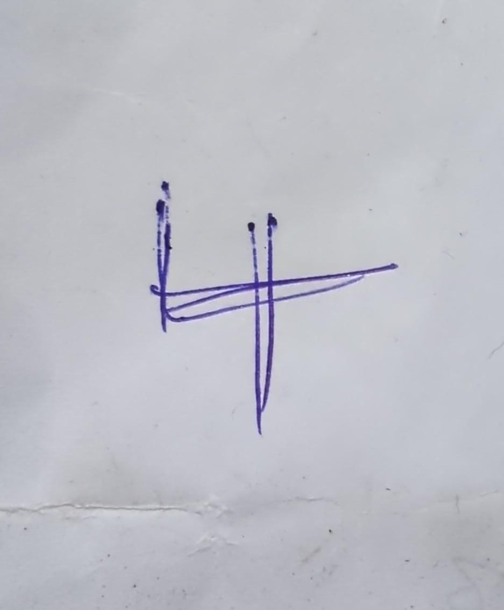
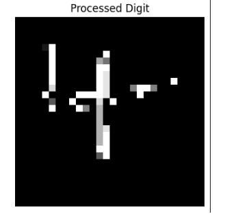
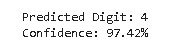

# 🔢 Handwritten Digit Recognition using CNN

A Deep Learning project that recognizes handwritten digits (0–9) from user-uploaded images using a Convolutional Neural Network (CNN) trained on the MNIST dataset. The project includes image preprocessing with OpenCV to enable predictions on real-world handwritten digits captured using a smartphone camera.

---

## 🚀 Project Overview

Handwritten digit recognition is a classic computer vision problem where a machine learns to identify numerical digits from images.

This project uses a CNN model built with TensorFlow/Keras and trained on the MNIST dataset. To improve usability beyond the dataset, an OpenCV-based preprocessing pipeline was implemented to transform real-world handwritten images into an MNIST-compatible format before prediction.

The complete workflow includes:

* Image Upload
* Image Preprocessing
* Digit Extraction
* CNN Prediction
* Confidence Score Generation

---

## ✨ Key Features

✅ CNN-based handwritten digit classification

✅ Trained on the MNIST dataset

✅ Supports custom handwritten image uploads

✅ OpenCV-based preprocessing pipeline

✅ Automatic digit contour detection

✅ MNIST-style image conversion

✅ Confidence score prediction

✅ Real-world handwritten digit testing

---

## 🛠️ Tech Stack

| Technology         | Purpose                 |
| ------------------ | ----------------------- |
| Python             | Programming Language    |
| TensorFlow / Keras | Deep Learning Model     |
| OpenCV             | Image Processing        |
| NumPy              | Numerical Computation   |
| Matplotlib         | Visualization           |
| Scikit-Learn       | Data Splitting          |
| Google Colab       | Development Environment |

---

## 📂 Dataset

### MNIST Dataset

The model was trained using the MNIST handwritten digit dataset.

* Training Images: 60,000
* Testing Images: 10,000
* Image Size: 28 × 28 pixels
* Classes: 10 (Digits 0–9)

---

## 🧠 CNN Architecture

Input Layer (28 × 28 × 1)

↓
Conv2D (32 Filters)

↓
Batch Normalization

↓
Conv2D (32 Filters)

↓
Max Pooling

↓
Dropout

↓
Conv2D (64 Filters)

↓
Batch Normalization

↓
Conv2D (64 Filters)

↓
Max Pooling

↓
Dropout

↓
Flatten

↓
Dense (256 Neurons)

↓
Dropout

↓
Softmax Output Layer (10 Classes)

---

## 🔄 Project Workflow

### Step 1: Upload Image

The user uploads a handwritten digit image.

### Step 2: Image Preprocessing

* Convert image to grayscale
* Apply thresholding
* Extract digit contour
* Resize digit
* Create MNIST-style 28×28 image

### Step 3: Prediction

The processed image is passed to the trained CNN model.

### Step 4: Output

The model predicts:

* Digit Class (0–9)
* Confidence Score

---

## 🌟 Real-World Testing

Unlike standard MNIST-only implementations, this project was tested using custom handwritten digits written on paper and captured using a smartphone camera.

The uploaded images undergo:

* Grayscale Conversion
* Thresholding
* Contour Detection
* Digit Cropping
* Resizing
* Normalization

before being passed to the CNN model.

This demonstrates the model's ability to work beyond the original MNIST dataset and handle real-world handwritten inputs.

---

## 📈 Results

### MNIST Dataset Performance

* Test Accuracy: ~99%

### Custom Handwritten Image Testing

The model was evaluated on handwritten digit images manually written on paper and captured using a mobile phone camera.

The OpenCV preprocessing pipeline significantly improved prediction performance on real-world inputs by converting uploaded images into an MNIST-compatible format.

---

## 📸 Sample Workflow

Input Image

→ 
Handwritten Digit Written on Paper

↓

Preprocessing

→ 
Digit Extraction & Resizing

↓

CNN Prediction

→ 
Predicted Digit + Confidence Score

---

## ⚙️ Installation

Clone the repository:

```bash
git clone https://github.com/your-username/MNIST-Handwritten-Digit-Recognition.git
```

Move into the project folder:

```bash
cd MNIST-Handwritten-Digit-Recognition
```

Install dependencies:

```bash
pip install -r requirements.txt
```

Run prediction:

```bash
python predict_digit.py
```

---

## 🎯 Future Enhancements

* Streamlit Web Application
* Multi-Digit Recognition
* Handwritten Equation Recognition
* Real-Time Webcam Prediction
* Model Deployment on Hugging Face Spaces
* Docker Support

---

## 💡 Learning Outcomes

Through this project, I gained practical experience in:

* Convolutional Neural Networks (CNNs)
* Image Preprocessing using OpenCV
* Computer Vision Fundamentals
* Deep Learning Model Training
* Model Evaluation
* Real-World Data Handling
* GitHub Project Documentation

---

## 👩‍💻 Author

**Shilpa Tumma**

Aspiring Data Analyst | Machine Learning Enthusiast

📌 Passionate about Data Analytics, Machine Learning, Deep Learning, and AI-driven solutions.

---

### ⭐ If you found this project useful, consider giving it a star!
